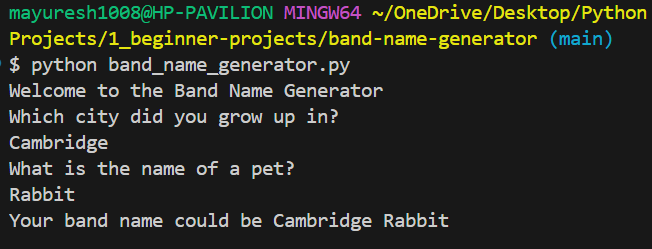

# 🎸 Band Name Generator

Welcome to the **Band Name Generator** — a fun and beginner-friendly Python project that takes user input and creatively suggests a band name based on your city and pet name!

---

## 🚀 How It Works

This simple program:

1. Welcomes the user
2. Asks for the name of the city they grew up in
3. Asks for the name of their pet
4. Combines both inputs to suggest a cool band name 🎶

---

## 🧠 Concepts Covered

- Basic `print()` statements
- Taking user `input()`
- String concatenation
- Displaying formatted output

---

## 💻 Sample Output

