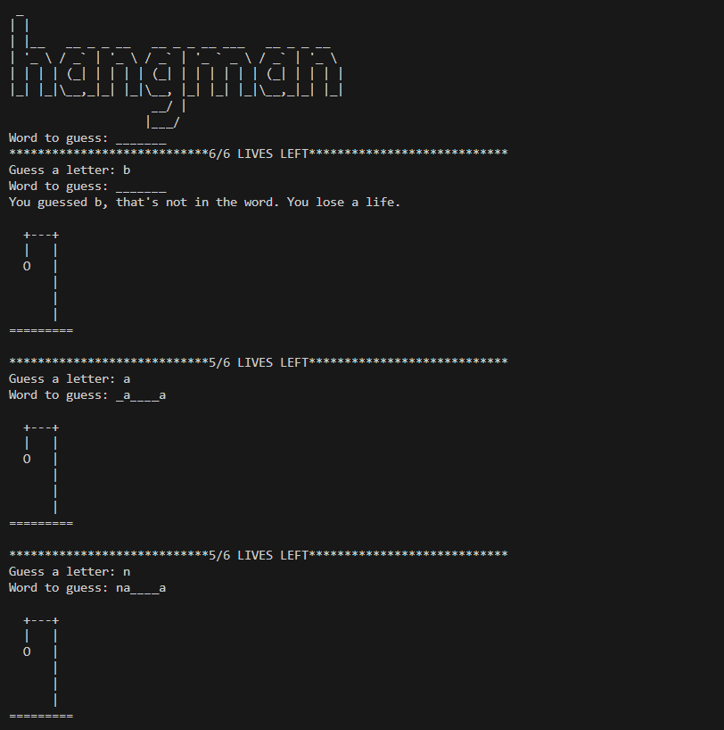
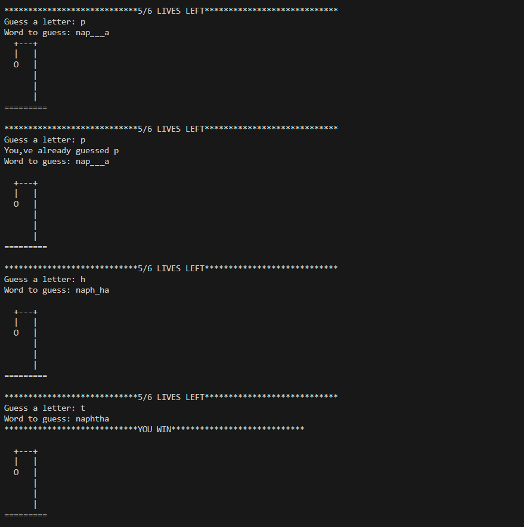
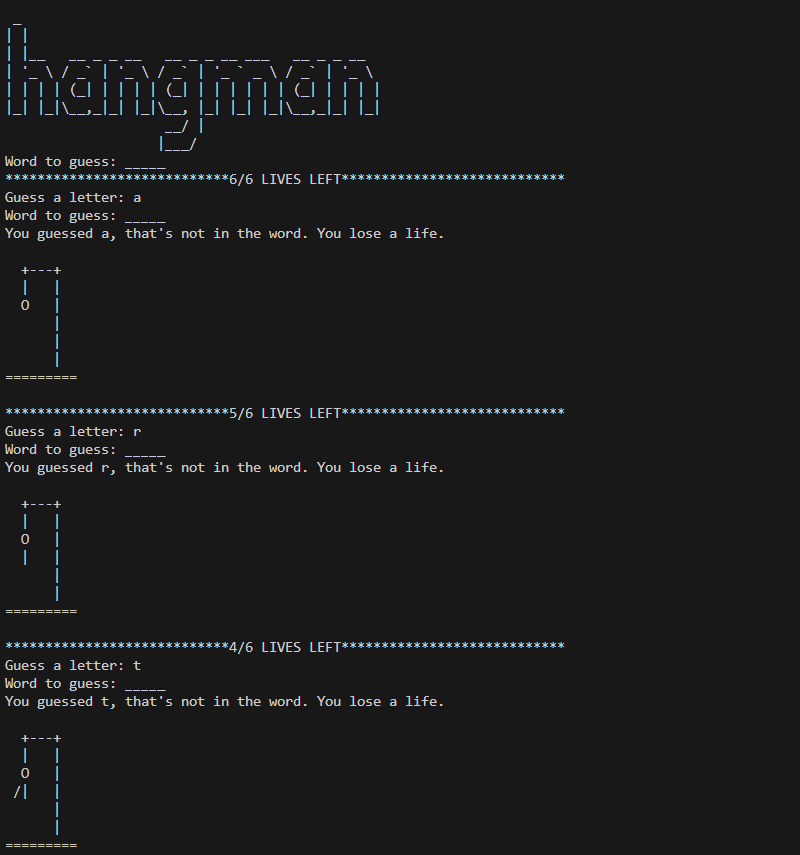
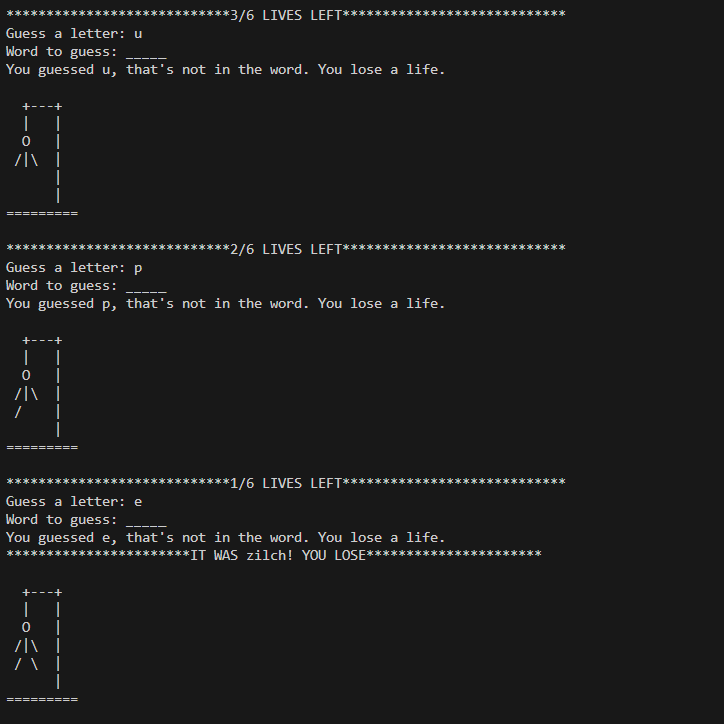

# 🎯 Hangman Game (Python CLI)

A fun and beginner-friendly Python implementation of the classic **Hangman game**, where the player guesses the hidden word one letter at a time before running out of lives!

---

## 📌 Features

- Random word selection from a word list  
- ASCII art for each stage of the hangman  
- Tracks incorrect guesses and remaining lives  
- Prevents repeated guesses  
- Clean CLI display with current word progress  
- Modular structure using `hangman_words.py` and `hangman_art.py`

---

## 🧠 Concepts Covered

- Python functions and loops (`for`, `while`)  
- Conditional logic (`if-else`)  
- List and string manipulation  
- Importing custom modules  
- Random module usage  
- User input handling

---

## 📁 Project Structure

hangman-game/
├── hangman.py # Main game logic
├── hangman_words.py # Contains word list
├── hangman_art.py # Contains ASCII logo and stages
└── README.md # Project documentation


---

## 💻 How to Run

1. Clone the repository or download the files  
2. Make sure Python is installed:

```bash
python --version
```
3. Run the game:
```bash
python hangman.py
```
> ⚠️ Important: Ensure hangman_words.py and hangman_art.py are in the same directory as hangman.py


## Sample Output:

### Winning Cause:





### Losing Cause:



