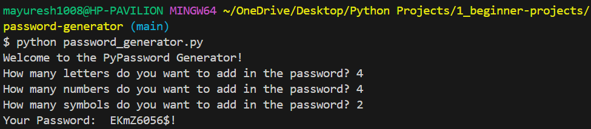

# 🔐 PyPassword Generator

A beginner-friendly **Python project** that generates strong, customizable passwords with a mix of letters, numbers, and symbols — both in easy and hard versions.

---

## 🚀 What It Does

- Prompts the user for:
  - Number of letters
  - Number of numbers
  - Number of symbols
- Generates a password accordingly
- Hard version shuffles characters for more randomness & security

---

## 🧠 Concepts Used

- Python `input()` function  
- Random selection with `random.choice()`  
- List operations and `random.shuffle()`  
- Loops (`for` loop, `range`)  
- String and list manipulation

---

## 💻 Sample Output

### Easy Version: 

### Hard Version:

