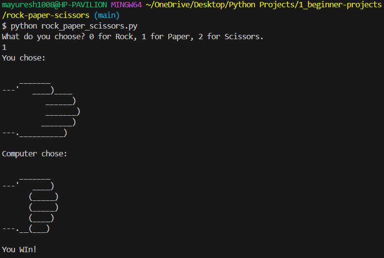

# ✊ 🧻 ✂️ Rock, Paper, Scissors — Python Game

A classic beginner-level **Python project** that lets you play Rock, Paper, Scissors against the computer — featuring fun **ASCII art graphics** and simple game logic 🕹️

---

## 🎮 How It Works

1. The user is prompted to choose:  
   `0 = Rock`, `1 = Paper`, `2 = Scissors`

2. The computer randomly selects its choice

3. ASCII art is displayed for both choices

4. The winner is determined based on standard game rules:
   - Rock beats Scissors  
   - Paper beats Rock  
   - Scissors beats Paper  
   - Same choice = Draw

5. If an invalid input is given, the game ends immediately ❌

---

## 🧠 Concepts Covered

- `input()` and type conversion  
- Using the `random` module  
- Conditional logic (`if-elif-else`)  
- Lists and indexing  
- Exit handling with `sys.exit()`  
- Multi-line string formatting (ASCII art)

---

## 💻 Sample Output

