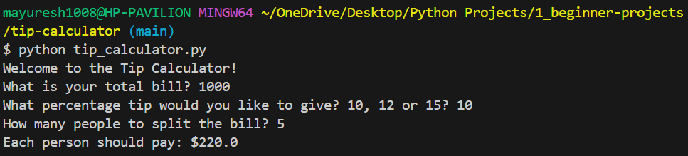

# 💰 Tip Calculator

A beginner-friendly **Python project** that helps you calculate how much each person should pay when splitting a bill, including tip. Great for real-life situations and practicing arithmetic & input handling in Python!

---

## 🚀 How It Works

This program:

1. Asks for the **total bill amount**
2. Asks the user what **tip percentage** they’d like to give (10, 12, or 15)
3. Asks how many **people** are splitting the bill
4. Calculates the tip and splits the total amount equally
5. Rounds the result to 2 decimal places and displays it

---

## 🧠 Concepts Covered

- `input()` and `print()` usage  
- Type conversion (`float`, `int`)  
- Arithmetic operations  
- Percentage calculation  
- `round()` function  
- f-string formatting

---

## 💻 Sample Output

