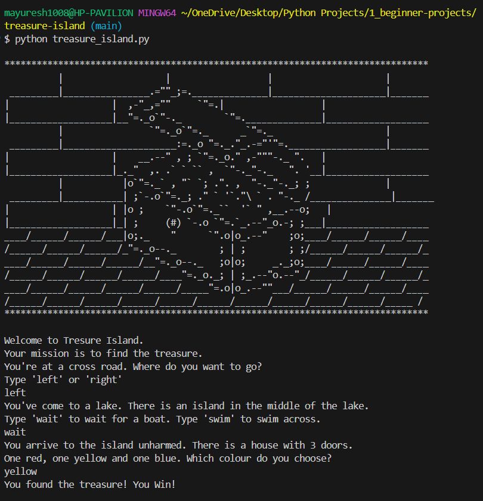

# 🏴‍☠️ Treasure Island

Welcome to **Treasure Island** — a fun and interactive **text-based adventure game** built in Python!  
Your mission is simple: **Find the hidden treasure**… or meet your doom along the way 💀

---

## 🕹️ Game Flow

This CLI game takes you through a series of decisions:

1. Choose to go **left or right** at a crossroad  
2. Decide to **wait** for a boat or **swim** across a lake  
3. Pick between **three doors** on a mysterious island 🏝️

But be warned — **one wrong move** could end your journey in an epic *Game Over*.

---

## 🧠 Concepts Covered

- `input()` and user interaction  
- `if-elif-else` conditional logic  
- `.lower()` string handling  
- Nesting conditionals (multi-level decisions)  
- Storytelling through terminal UI  

---

## 💻 Sample Output

